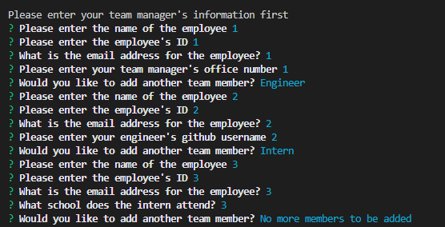

# Team Profile Generator

## Description

This product is designed to create a series of cards listing the information of employees apart of a specified team. This team must include a manager and any amount of engineers and interns.

## Table of Contents 

* [Installation](#installation-instructions)

* [Usage](#usage-information)

* [License](#license)

* [Contributing](#contributing-guidelines)

* [Tests](#test-instructions)

* [Questions](#questions)

## Installation Instructions

Please follow these steps when running this application.   1. git clone the repository to your local machine.  2. In terminal, CD into your destination folder application.  3. Type and enter 'npm install' to install the dependencies.  4. Type and enter 'node index.js' to run the application.  5. Your finished HTML will be created in the dist folder.

## Usage Information

This project should be used to create HTML pages for teams, listing their id, email etc. for company use and/or provide an open source code for users to see how to create an application similar to this one.  Hints to handling this application:   - Ensure that you start with the office managers information first before adding other members"

Link to video instructions on how to run the application:  
  https://1drv.ms/v/s!Avf51vHVO9u7mDHQ5eKBxCMinfsL?e=bHaL6p

example of questions layout:
  

## License

MIT: Permissive free license software. Please visit https://opensource.org/licenses/MIT for more information.
  
## Contributing Guidelines

Flipper5001 was the sole contributer for this project. If you wish to make any contributions, please refer to the questions section for our contact information.

## Test Instructions

The tests used for this application are listed in the __tests__ folder. These tests have been run to ensure that the application is working appropriately. The tests include, a test for manager, a test for engineer, a test for intern and a test for the base class employee.

## Questions

Other works can be found on https://github.com/Flipper5001.

If you have any questions or queries, please contact the following email address and we will get back to you as soon as possible.  
placeholder@gmail.com

